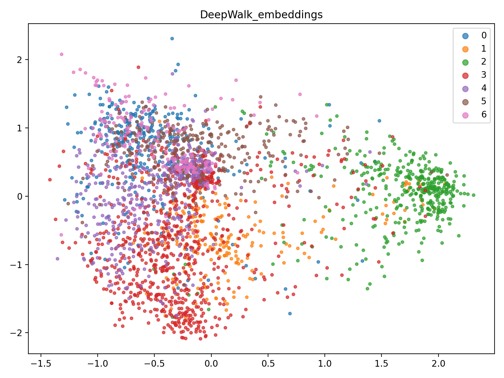
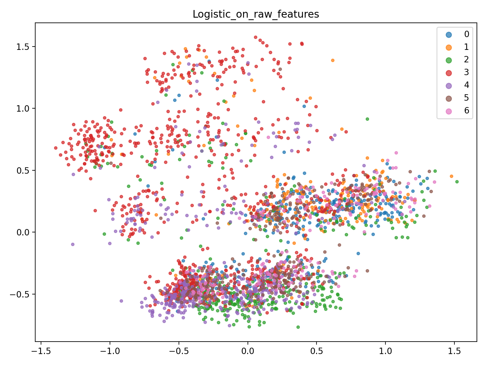
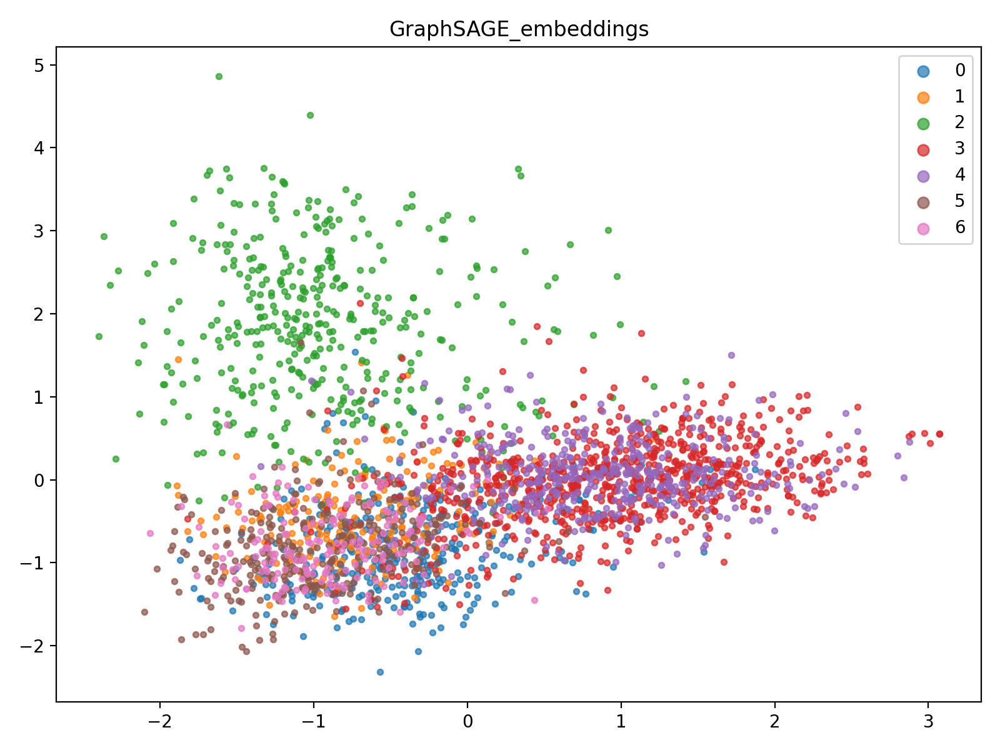

<html>
<body>
<h1>Social Network Analysis using GraphSAGE</h1>

<h2>About</h2>

Used GraphSAGE for clustering/node classification of a social network, achieving 80.5% accuracy-outperforming baseline models (Logistic Regression: 57.5%, DeepWalk: 68.6%) by ~22% and I have also shown that increasing neighbor samples (S1, S2) generally improved accuracy; however, adding more layers (K = 3) reduced performance. Variable sampling slightly outperformed fixed sampling, highlighting the advantage of adaptive neighborhood selection.

<h2>File Structure</h2>
<pre>
project/
├── .gitignore
├── config.py
├── main.py
├── MPResearch.pdf
├── README.md
├── data/
│   ├── experiments/
├── figures/
│   ├── DeepWalk_embeddings.png
│   ├── GraphSAGE_embeddings.png
│   └── Logistic_on_raw_features.png
├── models/
│   ├── deepwalk_model.py
│   ├── graphsage_model.py
│   └── logistic_regression.py
└── utils/
    ├── data_loader.py
    ├── metrics.py
    └── visualization.py
</pre>

<h2>Requirements</h2>
<pre>
torch>=2.0.0
torch-geometric>=2.4.0
scikit-learn>=1.1.0
matplotlib>=3.3.0
numpy>=1.21.0
pandas>=1.3.0
networkx>=2.5
gensim>=4.0.0
tqdm
</pre>

<h2>Figures</h2>

<h3>DeepWalk Embeddings</h3>

<h3>Logistic Regression on Raw Features</h3>

<h3>GraphSAGE Embeddings</h3>

<h2>How to Run</h2>
<pre>
# Install requirements
pip install -r requirements.txt
python main.py
</pre>

<h2>Conclusion</h2>

This project demonstrates the power of graph neural networks, specifically GraphSAGE, in capturing complex relationships in social networks.
By comparing with traditional methods like DeepWalk and evaluating on multiple tasks, we provide a comprehensive understanding of how node embeddings
can enhance network analysis. The modular structure allows easy experimentation and extension for further research in graph-based learning.

</body>
</html>
